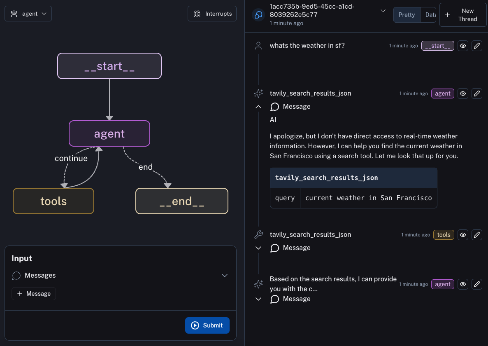

# LangGraph Cloud Example

This is an example agent to deploy with LangGraph Cloud.

In order to deploy this agent to LangGraph Cloud you will want to first fork this repo. After that, you can follow the instructions [here](https://langchain-ai.github.io/langgraph/cloud/) to deploy to LangGraph Cloud.
